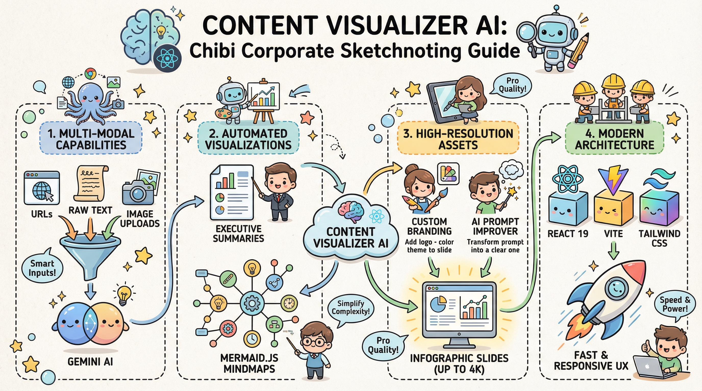

# Content Visualizer AI

**Content Visualizer AI** is a powerful React application that leverages the advanced capabilities of Google's Gemini models to analyze content from various sources and transform it into clear, visual summaries and professional infographics.

Whether you're researching a topic, summarizing a long article, or needing a quick visual for a presentation, this tool streamlines the process by generating executive summaries, structured mindmaps, and high-quality, branded slide visuals.



## 🚀 Features

- **Secure Authentication:**
  - **Google Sign-In:** Securely log in using your Google account to access the application.
  - **Backend Proxy:** API keys are stored securely on the server, keeping them safe from client-side exposure.

- **Multi-Modal Analysis:**
  - **URL Analysis:** Paste a link to a blog post or article, and the AI will browse and extract core concepts.
  - **Text Analysis:** Paste raw text directly for instant summarization.
  - **File Analysis:** Upload a file (e.g., a screenshot of a document, diagram, or PDF) to extract and visualize its content.

- **AI-Powered Insights:**
  - **Executive Summaries:** Get concise, formatted summaries with key takeaways and bolded terms.
  - **Automatic Mindmaps:** Generates Mermaid.js mindmap code to visualize the structure of the content.

- **Visual Generation & Branding:**
  - **Custom Branding Styles:** Define your own visual styles (e.g., "Corporate Dark", "Sketch Note") with custom prompts.
  - **AI Prompt Improver:** Use Gemini to refine your rough visual descriptions into professional, high-quality image generation prompts.
  - **Infographic Slides:** Generate beautiful, high-resolution (up to 4K) infographic slides based on your summary or mindmap.
  - **Downloadable Assets:** Easily download the generated visuals for your presentations.

## 🛠 Tech Stack

- **Frontend:** [React 19](https://react.dev/), [Vite](https://vitejs.dev/), [TypeScript](https://www.typescriptlang.org/), [Tailwind CSS](https://tailwindcss.com/)
- **Backend:** [Node.js](https://nodejs.org/), [Express](https://expressjs.com/)
- **Authentication:** [Google OAuth 2.0](https://developers.google.com/identity/protocols/oauth2), [@react-oauth/google](https://www.npmjs.com/package/@react-oauth/google)
- **AI Integration:** [Google GenAI SDK](https://www.npmjs.com/package/@google/genai)
- **Diagrams:** [Mermaid.js](https://mermaid.js.org/)

## 📋 Prerequisites

- **Node.js** (v18 or higher recommended)
- **Google Cloud Project** with:
  - **Generative Language API** enabled.
  - **OAuth 2.0 Client ID** configured.

## ⚙️ Installation & Setup

1.  **Clone the repository:**
    ```bash
    git clone https://github.com/batou9150/contentvisualizer-ai.git
    cd contentvisualizer-ai
    ```

2.  **Install dependencies:**
    ```bash
    npm install
    ```

3.  **Configure Environment Variables:**
    Create a `.env` file in the root directory with the following keys:
    ```env
    # Your Google Gemini API Key (Server-side)
    GEMINI_API_KEY=your_google_api_key_here

    # Your Google OAuth Client Credentials
    VITE_GOOGLE_CLIENT_ID=your_oauth_client_id
    VITE_GOOGLE_CLIENT_SECRET=your_oauth_client_secret
    ```

4.  **Run the application:**
    This command starts both the backend proxy server (port 3000) and the frontend dev server (port 5173) concurrently.
    ```bash
    npm run dev
    ```

5.  **Open in Browser:**
    Navigate to `http://localhost:5173`.

## 📖 Usage

1.  **Sign In:** Click "Sign in with Google" to access the application.
2.  **Select Input Mode:** Choose between **URL**, **Direct Text**, or **From File**.
3.  **Enter Content:** Paste the URL, text, or upload your image.
4.  **Analyze:** Click the **Analyze** button.
    - The AI will generate an Executive Summary and a Mermaid Mindmap.
5.  **Customize Branding:**
    - Click the **Branding** dropdown to select a style.
    - Click **New Branding** or the **Edit** icon to customize the visual style.
    - Use the **Improve** button to let AI refine your branding prompt.
6.  **Generate Visuals:**
    - Click **Generate Slide Visual** on the Summary or Mindmap section to create an infographic.
    - Select your desired resolution (1K, 2K, 4K).
    - Download the generated image.
7.  **Log Out:** Click your profile picture in the header to log out.

## 🤝 Contributing

Contributions are welcome! Please feel free to submit a Pull Request.

## 📄 License

This project is licensed under the MIT License.

## Screenshots


