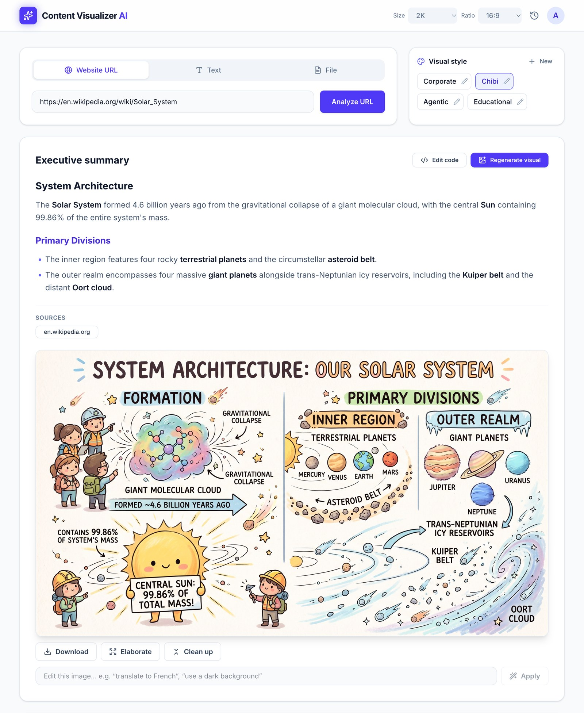

# Content Visualizer AI

Turn a web page, some text, or a PDF/image into an **executive summary**, a **Mermaid mindmap**, and **branded infographic slides**. You can then refine the slides with plain-language edits. Every visual is saved to your Google Drive.



## Features

- **Three inputs:** a URL (read with Gemini URL Context, grounded with Google Search, with sources listed), pasted text, or a PDF/image file up to 20 MB.
- **Analysis:** structured JSON output (summary, mindmap and title) from `gemini-3.8-flash`.
- **Editable results:** switch the summary (Markdown) or the mindmap (Mermaid) to code view and edit it before generating visuals.
- **Slide visuals** with `gemini-3.1-flash-image` (Nano Banana 2):
  - sizes 512px, 1K, 2K or 4K;
  - 10 aspect ratios;
  - built-in visual styles, plus custom ones with **Improve with AI**.
- **Real image editing:** "Elaborate", "Clean up" or any instruction continues the same Gemini interaction (`previous_interaction_id`). It edits the existing image instead of regenerating it.
- **Google Drive:** every visual goes to a *Content Visualizer AI* folder. The history drawer shows thumbnails, and delete moves files to the Drive trash.
- **Theme:** follows the system light or dark setting.

## Architecture

```
Browser (React 19 + Vite 8 + Tailwind 4)
   │  same-origin /api, httpOnly session cookie, no API keys or Google tokens in the browser
   ▼
Hono server on Node 24 (TypeScript run directly, no build step)
   ├─ Google Identity Services code flow → tokens kept in an AES-GCM-encrypted cookie, auto-refreshed
   ├─ Gemini Interactions API (@google/genai 2.x), server-side only
   └─ Google Drive REST API with the narrow `drive.file` scope
```

| Concern | v1 (previous version) | v2 (this rewrite) |
|---|---|---|
| Gemini API key | Proxy open to anyone, key in the dev bundle | Only used server-side, behind sign-in, with a per-user rate limit |
| Google tokens | `localStorage` (readable by XSS) | Encrypted httpOnly `SameSite=Lax` cookie |
| Drive scope | `drive` (whole Drive) | `drive.file` (only files the app created) |
| Gemini API | `generateContent` with preview models | Interactions API with stable `gemini-3.8-flash` and `gemini-3.1-flash-image` |
| Image "Improve" | Regenerates from scratch | Edits the previous image (`previous_interaction_id`) |
| Mermaid | `securityLevel: 'loose'` | `'strict'`, lazy-loaded |
| Markdown | Hand-rolled parser | `react-markdown` + GFM (no raw HTML) |
| Hardening | – | CSP, CSRF origin + header check, zod-validated inputs and env |
| Deploy | `gcr.io`, secrets as plain env vars | Artifact Registry, Secret Manager, non-root image |

## Local development

### Quick start (dev login, no OAuth)

Only needs Node 24+ and a Gemini API key from AI Studio:

```bash
cp .env.example .env     # set GEMINI_API_KEY, SESSION_SECRET (openssl rand -base64 32) and DEV_LOGIN=true
npm install
npm run dev
```

Open http://localhost:5173 and sign in with any name. Visuals are saved to `.local-data/` instead of Google Drive. `DEV_LOGIN` is refused when `NODE_ENV=production`. If the OAuth variables are also set, both sign-in options are shown.

### With Google sign-in and Drive

Prerequisites: Node 24+, plus a Google Cloud project with the **Gemini API** (an AI Studio key) and the **Google Drive API** enabled.

1. Create an **OAuth client ID** of type *Web application*. Add `http://localhost:5173` to **Authorized JavaScript origins**. No redirect URI is needed; the popup flow uses `postmessage`.
2. On the OAuth consent screen, add the scopes `openid`, `email`, `profile` and `.../auth/drive.file`.
3. Configure and run:

```bash
cp .env.example .env     # fill in the values; SESSION_SECRET: openssl rand -base64 32
npm install
npm run dev              # API on :3000 + Vite on :5173 (proxied)
```

Open http://localhost:5173.

| Script | What it does |
|---|---|
| `npm run dev` | API (watch mode) + Vite dev server |
| `npm run build` | Builds the client into `dist/` |
| `npm start` | Production server (serves `dist/` and `/api`) |
| `npm run typecheck` | TypeScript, client and server |
| `npm test` | Vitest unit tests |

## Deploy to Cloud Run

One-time setup:

```bash
PROJECT_ID=$(gcloud config get-value project)
REGION=europe-west1
gcloud services enable run.googleapis.com artifactregistry.googleapis.com cloudbuild.googleapis.com secretmanager.googleapis.com drive.googleapis.com generativelanguage.googleapis.com

gcloud artifacts repositories create contentvisualizer --repository-format=docker --location=$REGION

# Runtime service account that can read the secrets
gcloud iam service-accounts create contentvisualizer-ai
for s in contentvisualizer-gemini-api-key contentvisualizer-google-client-secret contentvisualizer-session-secret; do
  gcloud secrets create $s --replication-policy=automatic
  gcloud secrets add-iam-policy-binding $s \
    --member=serviceAccount:contentvisualizer-ai@$PROJECT_ID.iam.gserviceaccount.com --role=roles/secretmanager.secretAccessor
done
printf '%s' "$GEMINI_API_KEY"       | gcloud secrets versions add contentvisualizer-gemini-api-key --data-file=-
printf '%s' "$GOOGLE_CLIENT_SECRET" | gcloud secrets versions add contentvisualizer-google-client-secret --data-file=-
openssl rand -base64 32 | tr -d '\n' | gcloud secrets versions add contentvisualizer-session-secret --data-file=-
```

The Cloud Build service account also needs `roles/run.admin`, `roles/artifactregistry.writer`, and `roles/iam.serviceAccountUser` on the runtime service account.

Deploy:

```bash
gcloud builds submit --config cloudbuild.yaml \
  --substitutions=_GOOGLE_CLIENT_ID=xxx.apps.googleusercontent.com,_ALLOWED_USERS=@yourcompany.com
```

Finally, add the Cloud Run URL to the OAuth client's **Authorized JavaScript origins**.

`ALLOWED_USERS` (optional) restricts sign-in to specific emails or `@domains`. Leave it empty to allow any Google account. The rate limiter is in memory, so it applies per instance; use Redis or Memorystore if you scale out.

## Notes

- Image interactions are **stored** by the Gemini API, which is what makes follow-up edits possible. Analysis requests use `store: false`.
- Text and image models can be overridden with `TEXT_MODEL` and `IMAGE_MODEL`, for example `gemini-3-pro-image` for Nano Banana Pro.

## License

MIT, see [LICENSE](LICENSE).
